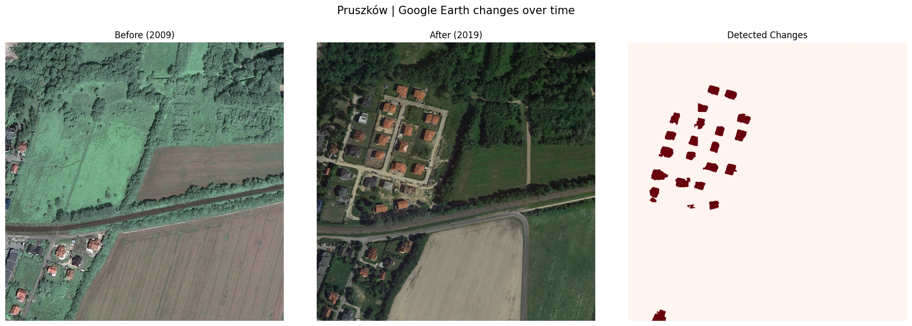
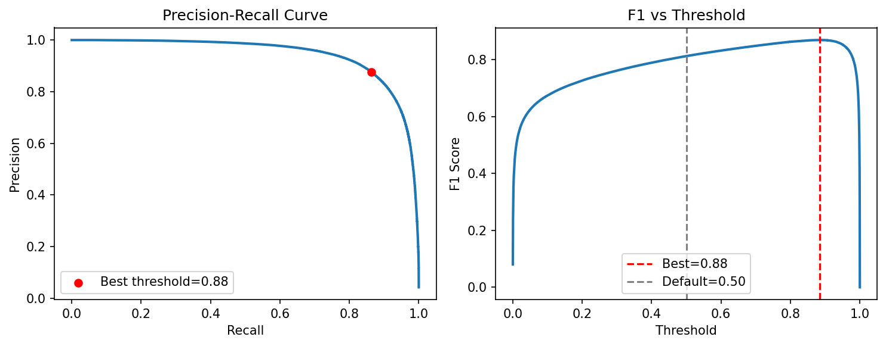
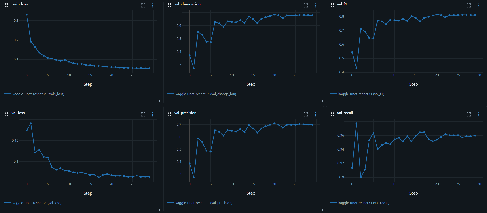

# Aerial Change Detection with U-Net 

This repository contains a U-Net model with Resnet-34 encoder
trained for detecting **building construction changes** in satellite imagery using the [LEVIR-CD](https://justchenhao.github.io/LEVIR/) dataset. It consists of pairs of before & after aerial images with pixel-wise change annotations. 

Training proved successful enough for the model to work well on real-world Google Earth images (example of landscape changes in my hometown's suburbs below).



Apart from training, two postprocessing steps were applied, which are tuning the threshold for binarizing the model's probabilistic output and filtering out the smallest connected components which are unlikely to be real changes rather than noise.

---
## Results
While assessing model's performance, main metrics taken into account were classical F1 Score and Intersection over Union (IoU) of the predicted change mask with the ground truth (being binary mask corresponding to pixels where changes occured).

Model performance on the test set under different configurations:


| Configuration | Change IoU | F1 | Precision | Recall |
|---|:---:|:---:|:---:|:---:|
| Default threshold (0.50) | 0.697 | 0.821 | 0.724 | 0.949 |
| Optimal threshold (0.885) | **0.774** | **0.873** | 0.887 | 0.859 |
| Min. component filter (300px) | 0.701 | 0.824 | 0.731 | 0.944 |
| Optimal threshold + min. component filter | 0.764 | 0.866 | 0.891 | 0.843 |

The default threshold gives high recall but mediocre precision, hence the model flagged too much. The precision-recall curve on the validation set lead to picking a much more conservative threshold (0.885) which at the cost of recall recovered 7.7 points of IoU.



Component filtering out changes smaller than 300 pixels managed to clean up some noise and slightly improve precision, nevertheless F1 and IoU didn't increase. Overall the model turned out to be pretty robust to noise and the optimal threshold alone was enough to get good results, with example inference results on the test set shown below.


---
## How to run the project

Model along with the environment has been containerized with Docker & everything is set up to run with Makefile commands. Configuration  file in the `config` folder contains all the default parameters for training, evaluation and inference.

Model training and evaluation can be run with the following:

```bash
make build
make train 
make evaluate THRESHOLD=0.885
make inference IMG_A=before.png IMG_B=after.png THRESHOLD=0.885
```

Data folder should be structured analogously to the LEVIR-CD dataset, with `train`, `val` and `test` subfolders, each containing `A`, `B` and `label` subfolders with before images, after images and change masks respectively.

For threshold tuning after training:

```bash
make postprocess
```

In order to set up MLflow UI at http://localhost:5000:

```bash
make mlflow-ui 
```


---
## Implementation notes

During training & inference, both images are concatenated into a single 6-channel tensor (3 (R, G, B) channels per image) and fed through a UNet, which despite being quite a simple approach turned out to work well. The ResNet-34 encoder learns to compare the two timestamps internally rather than needing an explicit difference operation.

One of the main obstacles in the training process was the class imbalance -
naturally, the change pixels are a minority of the data, so to combat this, a 10x class weight is applied to the `change` class in the loss function. 

To further improve the model's robustness, data augmentation is applied during training. The transformations include horizontal/vertical flips, random rotations, and color jitter, with the last one being applied independently to each image in the pair - if applied together, model wouldn't actually learn to detect the color shifts which change every day.
